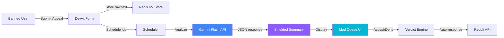

# ToxZen 🧘

*AI-shielded ban appeal processor that protects moderators from toxic content while helping them make faster, fairer decisions — all inside Reddit native UI.*

[](https://mod-tools-migration.devpost.com)
[](https://www.reddit.com/r/toxzen_app_dev/)
[](https://youtu.be/Zkb9pYqXVgA)


---

## 📸 See it in Action

> [📺 Watch the 60-second video demo on YouTube!](https://youtu.be/Zkb9pYqXVgA)
>
> **Toxic wall of text → AI-shielded summary with severity badge → one-click verdict.** The mod never reads a single slur.

---

## 💡 The Problem & Solution

A volunteer moderator of a 2-million-member subreddit opens their 47th ban appeal of the day — another wall of slurs, threats, and personal attacks — and wonders if it's worth continuing.

**Moderator burnout is real.** Studies show content moderators experience PTSD-like symptoms from prolonged toxic exposure. AutoMod can't summarize appeal content, assess remorse, or shield mods from emotional harm. Until now.

**ToxZen** uses Gemini Flash AI to create a protective shield between toxic content and moderators:

1. 📝 **User submits appeal** → Raw text stored in Redis with 30-day TTL
2. 🤖 **AI analyzes** → Generates clean, neutral summary + toxicity score + remorse signal
3. 🛡️ **Mod reviews shielded summary** → Makes verdict without reading toxic content
4. ✅ **One-click verdict** → Accept (auto-unban), Deny (auto-response), or Escalate

**Key Features:**
- 🛡️ **AI Content Shield:** Gemini Flash generates clinical summaries — never reproduces toxic language
- 🎯 **Severity Scoring:** 0–100 toxicity scale with color-coded badges (🟢 Low / 🟡 Medium / 🔴 High / ⛔ Extreme)
- 🧠 **Remorse Detection:** Genuine ✅ vs. Performative ⚠️ vs. Absent ❌ — AI identifies manipulation
- ⚡ **One-Click Verdicts:** Accept, Deny, Escalate with configurable auto-response templates
- 👁 **Raw Reveal (2-step):** Content warning dialog before showing unfiltered text — opt-in only
- 📊 **Wellness Dashboard:** "You've been shielded from 1,847 words of toxic content today"
- 🔒 **30-Day TTL:** All data auto-expires per Reddit's user-deletion compliance policies
- ⏱️ **Cooldown Enforcement:** 24-hour appeal cooldown prevents spam
- 🔁 **Manual Review Fallback:** If AI analysis fails after 3 retries, the appeal is flagged for manual review — mods can still issue verdicts without the AI summary
- ⚠️ **Low Confidence Warning:** When AI confidence is below 60%, a visual warning prompts the mod to verify manually before deciding

## 🏗️ Architecture & Tech Stack

| Layer | Technology |
|---|---|
| **Platform** | Devvit Web (Client/Server) |
| **Frontend** | React 19 + Vanilla CSS |
| **Server** | Hono (TypeScript) |
| **AI Engine** | Google Gemini 1.5 Flash (`responseMimeType: "application/json"`) |
| **Storage** | Devvit Redis (KV Store) with sorted sets |
| **Build** | Vite + @devvit/start plugin |
| **Testing** | Vitest |



### Server Endpoints (14 Hono routes)

| Endpoint | Type | Purpose |
|---|---|---|
| `/internal/menu/appeal-form` | Menu | Show appeal submission form |
| `/internal/menu/open-queue` | Menu | Create queue Custom Post |
| `/internal/menu/wellness` | Menu | Open wellness dashboard |
| `/internal/form/appeal-submit` | Form | Process appeal + schedule AI |
| `/internal/form/verdict-submit` | Form | Record mod verdict |
| `/internal/form/reveal-raw` | Form | Raw reveal confirmation handler |
| `/internal/scheduler/analyze-appeal` | Scheduler | Gemini API call with retry (3× exponential backoff) |
| `/api/appeals` | API | List pending appeals |
| `/api/appeal/:id` | API | Single appeal detail |
| `/api/appeal/:id/verdict` | API | Submit verdict from UI |
| `/api/appeal/:id/reveal` | API | Reveal raw text (opt-in) |
| `/api/appeal/:id/retry` | API | Retry failed Reddit actions (unban/modmail) |
| `/api/stats` | API | Daily wellness stats |
| `/api/seed` | API | Load demo appeals for playtesting |

## 🏆 Hackathon Track Alignment

| Track | Alignment |
|---|---|
| **Best New Mod Tool** ($10,000) | ✅ Novel capability AutoMod cannot do — AI content shielding + remorse detection |
| **Moderator's Choice** ($10,000) | ✅ Every moderator feels this pain personally — burnout from toxic appeals |

### Why Devvit is Load-Bearing

ToxZen cannot be rebuilt as a generic server app or swapped for a generic frontend stack. The Devvit platform is *load-bearing* in several critical areas:
1. **Interactive Custom Posts:** Renders the queue UI and wellness stats inside Reddit's native feed using Custom Post components, removing the friction of navigating to external dashboards.
2. **Reddit API Integration:** Unbans users and sends modmails securely via native platform primitives, avoiding external authentication complex scripts.
3. **Scheduler Service:** Handles the async execution of the Gemini Flash toxicity analysis without maintaining a separate message queue or server.
4. **Redis KV Store & Sorted Sets:** Stores raw appeals, analysis results, and daily wellness logs with a strict 30-day TTL policy, ensuring compliance with Reddit user data deletion policies.

## 🚀 Getting Started

### Fetch Domains Disclosure
This application makes outgoing HTTP requests to:
- `generativelanguage.googleapis.com` (Google Gemini Flash API for toxicity assessment)

Please ensure this domain is whitelisted/allowed in your environment settings (disclosed in accordance with Devvit review guidelines).

### Prerequisites
- Node.js ≥ 20
- npm
- [Devvit CLI](https://developers.reddit.com/docs/get-started/quickstart)

### Installation & Playtesting

1. **Clone the repository:**
   ```bash
   git clone https://github.com/edycutjong/toxzen.git
   cd toxzen
   ```

2. **Install dependencies:**
   ```bash
   npm install
   ```

3. **Log in to your Reddit developer account:**
   ```bash
   npx devvit login
   ```

4. **Set your Google Gemini API key:**
   ```bash
   npx devvit settings set geminiApiKey
   ```

5. **Start playtesting on your test subreddit:**
   ```bash
   # Build frontend assets
   npm run build

   # Start playtest
   npx devvit playtest <subreddit_name>
   ```

> **For Judges:** The app uses Devvit's built-in settings system. Set the Gemini API key via `npx devvit settings set geminiApiKey` after installing.
>
> **Demo mode:** Seed appeals (loaded via the "Seed Demo Data" button in the queue) skip live Reddit API calls (unban + modmail) since demo usernames don't exist on Reddit. All other app logic — AI analysis, shielding, wellness stats — runs normally on seeded data.

### Subreddit Installation

To install and deploy the app directly to your subreddit:
```bash
# Upload and register the app
npx devvit upload

# Install the app to your subreddit
npx devvit install <subreddit_name>
```


## 🧪 Testing & CI

```bash
npm run typecheck       # TypeScript strict mode
npm run test            # Vitest
npm run test:coverage   # Coverage report
npm run ci              # Full CI pipeline (typecheck + test + build)
```

CI runs on every push/PR against Node.js `[20, 22, 24]` matrix.

## 📁 Project Structure

```
ToxZen/
├── .github/
│   ├── workflows/
│   │   ├── ci.yml                    # CI pipeline (typecheck + test + build)
│   │   └── codeql.yml                # Security scanning
│   └── dependabot.yml                # Dependency updates
├── data/
│   └── fixtures/
│       └── appeals.json              # 5 seed appeals (demo data)
├── docs/                             # README assets
├── src/
│   ├── client/
│   │   ├── components/
│   │   │   ├── AppealCard.tsx        # Queue list card
│   │   │   ├── QueueView.tsx         # Appeal queue page
│   │   │   ├── RevealRawDialog.tsx   # 2-step content warning
│   │   │   ├── SeverityBadge.tsx     # Color-coded toxicity badge
│   │   │   ├── ShieldedReview.tsx    # Full appeal review
│   │   │   ├── VerdictButtons.tsx    # Accept/Deny/Escalate/Reveal
│   │   │   └── WellnessDashboard.tsx # Mod wellness stats
│   │   ├── styles.css                # Dark SOC theme (500+ lines)
│   │   ├── App.tsx                   # Main app with view routing
│   │   ├── main.tsx                  # React entry point
│   │   ├── queue.html                # Inline Custom Post entry
│   │   ├── review.html               # Expanded review entry
│   │   └── wellness.html             # Wellness dashboard entry
│   ├── server/
│   │   └── index.ts                  # Hono server (14 endpoints)
│   └── shared/
│       └── types.ts                  # TypeScript interfaces
├── devvit.json                       # Devvit app config
├── package.json                      # Dependencies & scripts
├── vite.config.ts                    # Vite + React + Devvit plugin
├── .env.example                      # Environment template
├── PRIVACY.md                        # Privacy policy
├── TERMS.md                          # Terms of service
├── LICENSE                           # MIT
└── README.md                         # You are here
```

## 📄 License

[MIT](LICENSE) © 2026 Edy Cu

## 🙏 Acknowledgments

Built for the [Devpost Mod Tools Migration Hackathon 2026](https://mod-tools-migration.devpost.com). Thank you to Reddit for the Devvit platform and Google for the Gemini API.

---

**🧘 Protecting the people who protect your community.**
