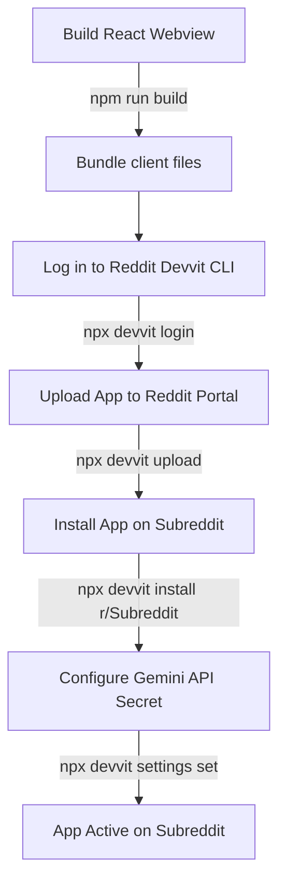

# 🚀 ToxZen — Deployment & Configuration Guide

Because **ToxZen** is a Reddit Devvit application, its deployment model is fundamentally different from a standard web app. Devvit applications run entirely on **Reddit's sandboxed serverless infrastructure** and render inside Reddit's native webview containers.

This guide outlines how to build, upload, configure, and install ToxZen on a subreddit.

---

## 📋 Prerequisites

Before deploying, ensure you have:
1.  **Node.js (v20 or higher)** installed on your machine.
2.  An active **Reddit account** with moderator permissions on the target test subreddit.
3.  A **Google Gemini API Key** (Gemini 1.5 Flash is recommended) to power the AI analysis.

---

## 🛠️ Step-by-Step Deployment Workflow



### 1. Build the React Webview Client
Devvit Custom Posts serve an inline webview compiled from the `src/client` React application. You must compile these assets first so they are ready to be bundled:
```bash
npm run build
```
This writes the production build assets directly to `dist/client/`.

### 2. Authenticate the Devvit CLI
Log into your Reddit account via the Devvit command-line tool. This will open a browser window requesting developer access:
```bash
npx devvit login
```

### 3. Upload the App Version
Upload the compiled server and client bundles to Reddit's Devvit developer portal. This registers a new version of the app on your developer account:
```bash
npx devvit upload
```
*Note: This command reads configuration settings directly from [devvit.json](file:///Users/edycu/Projects/Hackathon/ToxZen/devvit.json).*

### 4. Install the App on your Subreddit
Install the uploaded version on your test subreddit (e.g., `r/ToxZenDemo`).
```bash
npx devvit install <subreddit_name>
```
*   **Target Subreddit:** Enter the name of the subreddit without the `r/` prefix.
*   **Subreddit Settings:** The installation prompt will ask you to verify or input default configuration settings. You can press Enter to accept the defaults.

### 5. Configure the Google Gemini API Secret
ToxZen requires a Gemini API key to run its analytical tasks. Unlike traditional apps, **setting a local `.env` file does not pass environment variables to Reddit's remote servers.** 

You must configure the API key using one of these two methods:

#### Method A: Via Command Line (Recommended)
Run the following CLI command to update your installation settings:
```bash
npx devvit settings set geminiApiKey
```
*   You will be prompted to select your active installation.
*   Enter your Google AI Studio Gemini API Key. The CLI marks this field as a secret, masking the key during input.

#### Method B: Via Reddit Moderation Panel
If you prefer a visual interface, you can set it directly on Reddit:
1.  Navigate to your target subreddit on Reddit (redesigned desktop Web interface).
2.  Click **Mod Tools** in the left sidebar.
3.  Under the **Apps** section, select **ToxZen**.
4.  Find the **Google AI API Key (Gemini Flash)** field under the global app settings section.
5.  Paste your Gemini API key and click **Save**.

---

## 🔬 Local Development & Playtesting

If you want to iterate locally and see live updates in a sandbox subreddit without running a full production upload:

1.  Start the watch builder and local playtest listener:
    ```bash
    npm run dev
    ```
2.  This command runs `devvit playtest` which:
    *   Watches changes in `src/client` and compiles webview assets.
    *   Spawns a local Devvit development server.
    *   Instructs you to visit a special playtest subreddit link where the app's components are rendered live in developer mode.

---

## 🚀 Publishing to the Reddit App Directory

For hackathon submissions, installing the app as a developer build on a test subreddit is sufficient for judging. However, if you wish to publish your app publicly for anyone to install:
```bash
npx devvit publish
```
*Note: Public publication triggers an automated verification and safety check by the Reddit Devvit review team before listing the app in the public directory.*

---

## 🔒 Security & Data Compliance Note
All raw appeals and toxicity scores are saved with an **automatic 30-day TTL (Time-To-Live)** inside the Redis key-value store. This ensures automatic compliance with Reddit's data-deletion policies, meaning no personal user data persists indefinitely.
